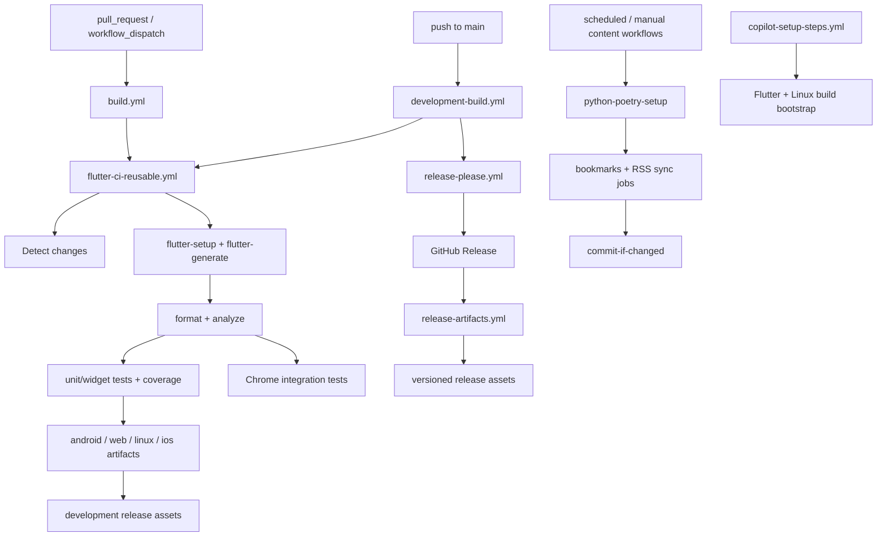

# GitHub Actions Architecture

This directory contains the reusable composite actions that power the repository's
GitHub Actions workflows.

## Composite actions

| Action | Purpose | Used by |
| --- | --- | --- |
| `flutter-setup` | Install Flutter, restore pub cache, and fetch app dependencies | `flutter-ci-reusable.yml`, `release-artifacts.yml`, `copilot-setup-steps.yml` |
| `flutter-generate` | Run localization and `build_runner` code generation | `flutter-ci-reusable.yml`, `release-artifacts.yml`, `copilot-setup-steps.yml` |
| `install-linux-build-deps` | Install shared Linux system packages for Flutter builds | `flutter-ci-reusable.yml`, `release-artifacts.yml`, `copilot-setup-steps.yml` |
| `python-poetry-setup` | Set up Python + Poetry, restore `.venv`, and install Python tool dependencies | `bookmarks-extract.yml`, `medium-rss-sync.yml`, `pinterest-rss-sync.yml` |
| `commit-if-changed` | Stage, commit, and push generated content updates when files changed | `bookmarks-extract.yml`, `medium-rss-sync.yml`, `pinterest-rss-sync.yml` |

## Workflow lifecycle

## Maintenance contract

When you change any file under `.github/workflows/` or `.github/actions/`:

1. Update this README if the workflow graph, action inventory, or responsibilities changed.
1. Keep the diagram aligned with the actual trigger and artifact flow.
1. Prefer extending an existing composite action before duplicating setup logic in a workflow.
1. Keep workflow permissions narrow at the workflow or job level.

## Notes for Copilot-assisted changes

If an agent edits GitHub Actions files, treat this README as part of the same
change surface and refresh the diagram whenever the lifecycle changed.
