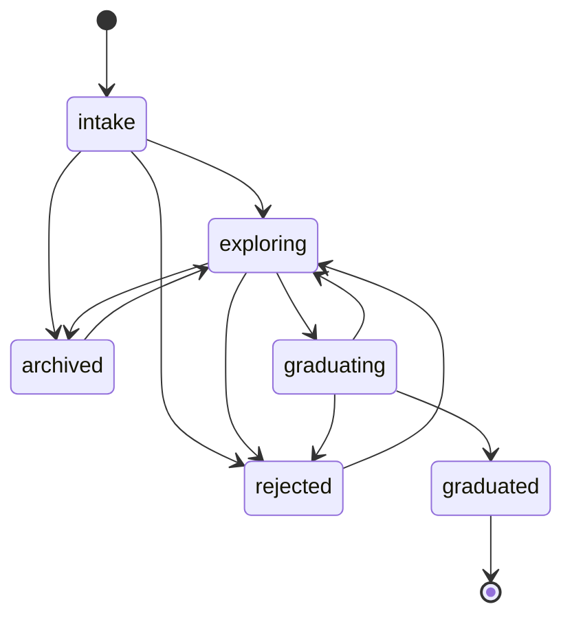

# Sanctuary Architecture

Status: **provisional**

Decision: [`ADR-0001`](docs/decisions/ADR-0001-sanctuary-incubation-boundary.md)

Organization intake: [`egohygiene/.github#12`](https://github.com/egohygiene/.github/issues/12)

## Purpose and ownership

Sanctuary is the Ego Hygiene ecosystem's bounded workspace for unfinished,
imported, experimental, or ownerless work. It owns the evidence needed to
evaluate that work:

- an indexed incubation record;
- source identity, license, attribution, and immutable revision where possible;
- a named owner and reviewers;
- a question the experiment is intended to answer;
- lifecycle and baseline-exception evidence;
- candidate durable destinations and exit criteria; and
- a reviewed graduation, archival, or rejection decision.

Sanctuary does not acquire permanent ownership merely because source is placed
here. A substantial incubation without a valid manifest is invalid repository
state.

## Trust boundary

Sanctuary is public. Only data intentionally classified for public disclosure
may enter the repository. Credentials, personal/private data, production state,
machine-specific state, and large generated artifacts remain outside Git.

External source must have a known license and attribution. When an immutable
source revision exists, the manifest must record it. The validator cannot prove
license compatibility or secret absence; reviewers remain responsible for
those judgments.

## Lifecycle



`graduating` is a review state, not permission to copy source. `graduated`
requires an approved ownership decision and a durable destination. Terminal
records remain indexed so future maintainers can understand what happened.

## Repository shape

```text
incubations/
  index.json
  <incubation-id>/
    incubation.json
    README.md
    ... experimental source and local evidence ...
```

The index is a projection maintained in the same pull request as each
incubation manifest. `tools/validate_incubations.py` checks required structure,
allowed state transitions expressed by the current record, source evidence,
decision requirements, directory identity, and index/manifest agreement.

## Ecosystem boundaries

| Repository | Relationship to Sanctuary |
| --- | --- |
| Hygiene | Owns organization architecture, canonical repository registry, and any future organization-wide incubation policy. |
| `.github` | Routes ownerless organization work to Sanctuary; it is not the implementation owner. |
| Empathy | Remains the strict golden baseline and golden consumer; it does not receive new general incubation. |
| Holon | May create Sanctuary from a future approved incubator blueprint; it does not materialize or graduate individual incubations. |
| Pace | May propose reviewable updates to Sanctuary's approved managed baseline; it must not mutate incubation source, manifests, states, or decisions. |
| Observatory | May read public lifecycle evidence and report inventory or age; it does not decide graduation. |
| Aether | May publish versioned agent or specification artifacts consumed during experiments; Sanctuary does not copy their canonical source. |
| Durable capability owner | Receives graduated work through a reviewed migration with preserved provenance and an immutable or versioned contract. |

Stable repositories must not use a branch, path, or mutable commit in Sanctuary
as a production dependency. Graduation transfers or reconstructs the work at
its durable owner; consumers then depend on that owner's versioned release.

## Exception model

An incubation may diverge from the normal repository baseline when the
exception is necessary to answer its question. Every exception records the
rule, rationale, approver, and expiry date. Exceptions never waive public-data,
secret, provenance, license, or ownership requirements.

## Promotion boundary

Graduation is approved only when:

1. the experiment's question has an evidence-backed answer;
2. one durable owner accepts explicit ownership and non-ownership;
3. source license and provenance remain traceable;
4. tests or other validation appropriate to the capability exist;
5. migration and rollback/recovery behavior are documented;
6. baseline exceptions are closed or explicitly re-approved by the destination;
7. stable consumers can use a versioned artifact or contract; and
8. a new repository, if proposed, has a separate Hygiene ownership decision.

The destination pull request or issue links back to the Sanctuary record. The
record then becomes a small provenance tombstone rather than disappearing.
