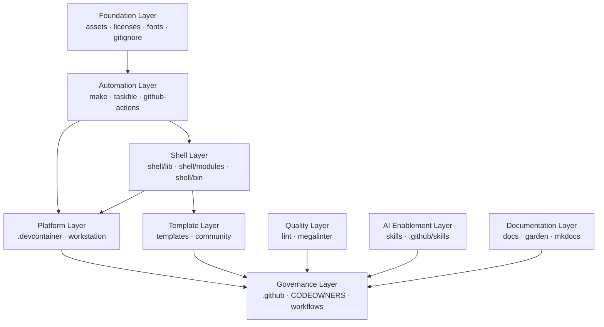

# Architecture Audit — Sanctuary Platform

> **Status:** Initial audit — June 2026
> **Scope:** Full repository including `.staging/realignment/` historical material
> **Purpose:** Descriptive analysis only. No structural changes are performed here.

---

## 1. Repository Identity

### What Is Sanctuary?

Sanctuary is the engineering platform foundation for the Ego Hygiene organization. It is a monorepo-style collection of reusable infrastructure that spans workstation configuration, shell tooling, project templates, assets, documentation, automation, and AI-assisted development workflows.

The repository serves as the authoritative source of shared engineering infrastructure. Future repositories in the organization should consume Sanctuary rather than independently invent equivalent tooling.

The `pyproject.toml` and `package.json` both define `sanctuary` as their package name, with descriptions aligning to "developer experience," "platform engineering," "automation," "templates," and "knowledge management."

### What Sanctuary Should Own

- Reusable engineering infrastructure (Make library, Taskfile, GitHub Actions)
- Developer workstation configuration (Linux, macOS, shared)
- Dev Container and Codespace configuration
- Shell framework (library, modules, init)
- Project and community templates
- Canonical asset collections (fonts, emojis, gitignore templates, license templates, shields)
- Repository governance templates and linting configuration
- Documentation platform and knowledge garden
- AI-assisted development skills (GitHub Copilot CLI skills)

### What Sanctuary Should Explicitly Not Own

- Application source code (belongs in product repositories)
- Product-specific CI pipelines unrelated to platform governance
- User-specific homelab or private infrastructure configuration
- Research papers and academic material without a direct tooling connection
- Flutter application code

---

## 2. Top-Level Architecture

The following evaluates each top-level directory as observed in the repository.

### `assets/`

**Purpose:** Canonical asset library for the engineering platform.

**Primary responsibility:** Centralized source of truth for shared visual and configuration assets.

**Contents:**

| Sub-directory | Contents |
|---|---|
| `emojis/` | Full GitHub-compatible emoji PNG collection (Google + misc) |
| `fonts/` | Font assets |
| `gitignore/` | `.gitignore` templates by language and platform (`AL.gitignore`, `Android.gitignore`, etc.) |
| `licenses/` | License text files (Apache 2.0, GPL variants, Boost) |
| `shields/` | Badge/shield assets |
| `terminal/` | Terminal configuration assets |
| `windows/` | Windows-specific asset configurations |

**Consumers:** Templates, repository governance, documentation tooling.

**Dependencies:** None. This is a leaf-level provider.

**Relationship:** Foundation layer. All other layers may reference assets; assets should reference nothing else.

---

### `automation/`

**Purpose:** Reusable automation primitives.

**Primary responsibility:** Provides a composable GNU Make library for use across repositories.

**Contents:**

| File | Purpose |
|---|---|
| `make/Makefile` | Root entry point; orchestrates all Make modules |
| `make/colors.mk` | Terminal color variables |
| `make/common.mk` | Common Make patterns and utilities |
| `make/gmsl.mk` | GNU Make Standard Library integration |
| `make/os.mk` | OS detection and conditionals |
| `make/project.mk` | Project-level Make conventions |
| `make/utils.mk` | Utility macros |
| `make/variables.mk` | Global variable declarations |

**Consumers:** Any repository that includes this Make library as a submodule or copies it.

**Dependencies:** GNU Make ≥ 3.81. No external runtime dependencies.

**Relationship:** Automation layer. Consumed by CI/CD and local development workflows.

---

### `docs/`

**Purpose:** MkDocs-based documentation site.

**Primary responsibility:** Publishes repository intelligence artifacts and documentation to GitHub Pages.

**Contents:**

| Sub-directory | Contents |
|---|---|
| `docs/copilot/` | GitHub Copilot allowlist documentation |
| `docs/generated/` | Generated repository intelligence (tree, visualization) |
| `docs/stylesheets/` | Custom MkDocs Material CSS overrides |
| `docs/javascripts/` | Custom JavaScript for the documentation site |
| `docs/index.md` | Landing page |
| `docs/architecture/` | Architecture audit documents (this set of files) |

**Consumers:** Human readers via GitHub Pages; CI pipeline (`github-pages.yml`).

**Dependencies:** MkDocs 1.6.1, mkdocs-material 9.7.6, Python 3.12+.

**Relationship:** Documentation layer. Consumes generated outputs from automation. Does not drive any production behavior.

---

### `garden/`

**Purpose:** Personal knowledge base and digital garden.

**Primary responsibility:** Structured personal knowledge management (Obsidian-compatible vault).

**Contents:**

| Sub-directory | Purpose |
|---|---|
| `garden/awesome/` | Curated references and resource lists |
| `garden/concepts/` | Conceptual notes |
| `garden/content/` | Published content drafts |
| `garden/dashboards/` | Overview and navigation notes |
| `garden/experiments/` | Exploratory notes and experiments |
| `garden/health/` | Health and wellbeing tracking |
| `garden/journal/` | Time-based journal entries |
| `garden/maps/` | Maps of content (MOC notes) |
| `garden/notes/` | General notes |
| `garden/projects/` | Project planning notes |
| `garden/publish/` | Notes flagged for external publishing |
| `garden/quartz/` | Quartz digital garden publishing integration |
| `garden/reflections/` | Reflective writing |
| `garden/research/` | Research notes |
| `garden/templates/` | Obsidian note templates |

**Consumers:** Human authors. Quartz publishing pipeline.

**Dependencies:** Obsidian (tool), Quartz (publishing). Functionally isolated from the rest of Sanctuary.

**Relationship:** Documentation/knowledge layer. Largely self-contained. Overlaps in spirit with `docs/` but serves a different audience and workflow.

---

### `lint/`

**Purpose:** Repository-wide linting configuration.

**Primary responsibility:** Centralizes MegaLinter configuration and language-specific linting rules.

**Contents:**

`lint/config/` contains per-language MegaLinter configuration directories:

```
actions, ansible, api, arm, checkstyle, clojure, cloudformation,
coffee, commits, copypaste, cpp, css, dart, dockerfile, editorconfig,
gherkin, go, graphql, groovy, html, java, javascript, json, latex,
lua, makefile, markdown, php, powershell, prose, protobuf, puppet,
python, r, raku, repo, rst, ruby, rust, salesforce, scala, security,
shell, snakemake, sql, swift, system, tekton, terraform, yaml
```

`lint/megalinter.sh` — script to invoke MegaLinter.

**Consumers:** GitHub Actions CI (`sanity.yml`, `vitality.yml`), local development.

**Dependencies:** MegaLinter Docker image; individual linter tools per language.

**Relationship:** Quality layer. Consumed by CI and developers. Does not produce build artifacts.

---

### `scripts/`

**Purpose:** Repository utility scripts.

**Primary responsibility:** Contains the `megalinter.sh` invocation helper; at present appears focused on linting orchestration.

> **Note:** The `scripts/` directory at the time of this audit contains only `megalinter.sh`. Additional scripts may be added over time.

**Consumers:** CI pipelines, local development.

**Dependencies:** Bash, Docker.

**Relationship:** Automation utility layer.

---

### `shell/`

**Purpose:** Cross-shell runtime framework.

**Primary responsibility:** Provides a modular, extensible shell library that can be sourced in Bash or compatible shells.

**Contents:**

| Sub-directory | Purpose |
|---|---|
| `shell/lib/core/` | Core shell utilities: `shell.sh` (runtime detection), `bash.sh`, `colors.sh`, `core.sh`, `guards.sh`, `logging.sh`, `os.sh`, `time.sh` |
| `shell/lib/extensions/` | Extended shell utilities: `cache.sh`, `environment.sh`, `history.sh`, `privacy.sh`, `tooling.sh`, `xdg.sh` |
| `shell/lib/modules.sh` | Module loader |
| `shell/modules/` | Shell modules |
| `shell/init/` | Bootstrap scripts: `bootstrap.sh`, `init.sh`, `load-core.sh`, `load-extensions.sh` |
| `shell/bin/` | Executable utilities: `cb`, `convert-to-ico`, `generate-certs`, `generate-password`, `generate-tree`, `ghignore`, `ghprotect`, `git-remove-exec-no-shebang`, `is-executable`, `sysinfo` |
| `shell/tests/` | Bats test suite |

**Consumers:** Workstation setup, Dev Container initialization, CI sanity checks.

**Dependencies:** Bash 4+; some utilities depend on external tools (`openssl`, `gh`, `tree`).

**Relationship:** Platform layer — shell. Consumes nothing from Sanctuary except possibly assets; provides primitives to workstation and devcontainer layers.

---

### `skills/`

**Purpose:** GitHub Copilot CLI skill library.

**Primary responsibility:** Provides a curated library of reusable AI-assisted development prompts for GitHub Copilot.

**Contents:** One sub-directory per skill, each containing a `SKILL.md`. Examples include: `acquire-codebase-knowledge`, `architecture-blueprint-generator`, `conventional-commit`, `security-review`, `threat-model-analyst`, and many more.

**Consumers:** GitHub Copilot CLI users working in any repository; referenced by `.github/skills/` and `.agents/skills/`.

**Dependencies:** GitHub Copilot CLI. No runtime dependencies.

**Relationship:** AI enablement layer. Skills are self-contained prompts; they reference no other Sanctuary code.

> **Duplication note:** `skills/` at the repository root, `.agents/skills/`, and `.github/skills/` all appear to serve the same purpose. See [Duplication Report](duplication-report.md).

---

### `templates/`

**Purpose:** Project scaffolding templates.

**Primary responsibility:** Provides starter templates for new applications and community governance documents.

**Contents:**

| Sub-directory | Contents |
|---|---|
| `templates/applications/` | Application templates (`react-vite/`) |
| `templates/changesets/` | Changeset configuration templates |
| `templates/community/` | Community governance (`GOVERNANCE.md`) |
| `templates/paper/` | Academic/research paper templates |
| `templates/poetry/` | Python Poetry project templates |

**Consumers:** Engineers starting new projects; repository governance automation.

**Dependencies:** Templates themselves depend on their target stacks (e.g., Node.js for `react-vite`). No Sanctuary runtime dependency.

**Relationship:** Template layer. Downstream consumers copy or reference templates; templates do not consume other Sanctuary layers.

---

### `workstation/`

**Purpose:** Cross-platform workstation configuration.

**Primary responsibility:** Provides reproducible developer workstation setup for Linux and macOS.

**Contents:**

| Sub-directory | Contents |
|---|---|
| `workstation/linux/` | Linux-specific configs: audio (ALSA), authentication, Bluetooth, fonts, graphics (NVIDIA), Flatpak, GRUB, hardware, modprobe, nautilus, security, systemd, sysctl, sudoers, thumbnailers, tmux, VMware |
| `workstation/macos/` | macOS configs: Homebrew |
| `workstation/shared/` | Cross-platform: `ack`, `alacritty`, `aria2`, `readline`, `shell` |

**Consumers:** Engineers setting up or re-imaging a developer workstation.

**Dependencies:** Platform package managers (`apt`, `homebrew`); systemd (Linux).

**Relationship:** Workstation layer. Consumes `shell/` for shell configuration; may reference assets.

---

### `.devcontainer/`

**Purpose:** Dev Container and GitHub Codespace configuration.

**Primary responsibility:** Provides a reproducible containerized development environment.

**Contents:**

| File | Purpose |
|---|---|
| `devcontainer.json` | Primary Dev Container spec |
| `devcontainer.yml` | Docker Compose configuration for the container |
| `Dockerfile` | Container image definition |
| `scripts/` | Container lifecycle scripts (initialize, onCreateCommand, etc.) |

**Consumers:** VS Code Dev Containers, GitHub Codespaces, CI environments needing a standardized shell.

**Dependencies:** Docker, VS Code or a compatible IDE.

**Relationship:** Platform layer — containerized. Consumes `shell/` and workstation shared config; acts as the containerized equivalent of the workstation layer.

---

### `.github/`

**Purpose:** GitHub repository governance and automation.

**Primary responsibility:** Centralizes all GitHub-native configuration: CI/CD workflows, issue templates, pull request templates, Copilot instructions, Actions, and repository-level agents/skills.

**Contents:**

| Sub-directory | Purpose |
|---|---|
| `.github/workflows/` | GitHub Actions workflows |
| `.github/actions/` | Custom composite Actions |
| `.github/ISSUE_TEMPLATE/` | Issue templates |
| `.github/PULL_REQUEST_TEMPLATE.md` | Pull request template |
| `.github/CODEOWNERS` | Code ownership configuration |
| `.github/copilot-instructions.md` | Repository-level Copilot instructions |
| `.github/agents/` | Agent configuration |
| `.github/skills/` | GitHub Copilot skills (linked to `skills/`) |
| `.github/specs/` | Feature specifications |
| `.github/scripts/` | Workflow helper scripts |
| `.github/dependabot.yml` | Dependabot configuration |
| `.github/codeql.yml` | CodeQL configuration |
| `.github/actionlint.yaml` | Action linting configuration |

**Key workflows:**

| Workflow | Purpose |
|---|---|
| `github-pages.yml` | Builds and deploys MkDocs documentation |
| `repository-intelligence.yml` | Generates repository structure artifacts |
| `sanity.yml` | MegaLinter code quality checks |
| `vitality.yml` | Repository health checks |
| `dependency-review.yml` | Dependency vulnerability review |
| `reuse.yml` | REUSE license compliance check |
| `copilot-setup-steps.yml` | Copilot environment setup |
| `contributors.yml` | Contributors tracking |
| `codeql.yml` | (Config only) CodeQL analysis settings |

**Consumers:** GitHub platform; CI/CD automation.

**Dependencies:** GitHub Actions runtime; external actions referenced in workflows.

**Relationship:** Governance layer. Operates at the repository boundary. Consumes and orchestrates all other layers through automation.

---

## 3. Responsibility Matrix

See [Responsibility Matrix](responsibility-matrix.md) for full per-area ownership breakdown.

**Summary table:**

| Responsibility Area | Primary Directory | Classification |
|---|---|---|
| Asset management | `assets/` | Foundational |
| Make automation library | `automation/make/` | Foundational |
| Documentation platform | `docs/` + `mkdocs.yml` | Foundational |
| Knowledge garden | `garden/` | Shared |
| Linting / quality enforcement | `lint/` | Foundational |
| Shell framework | `shell/` | Foundational |
| AI skills library | `skills/` | Shared |
| Project templates | `templates/` | Shared |
| Workstation configuration | `workstation/` | Implementation-specific |
| Dev Container | `.devcontainer/` | Foundational |
| Repository governance | `.github/` | Foundational |
| Historical material | `.staging/` | Historical |

---

## 4. Platform Layering



**Layer definitions:**

| Layer | Directories | May depend on |
|---|---|---|
| Foundation | `assets/`, `assets/licenses/`, `assets/gitignore/` | Nothing |
| Automation | `automation/make/`, `Taskfile.yml` | Foundation |
| Shell | `shell/` | Foundation, Automation |
| Platform | `.devcontainer/`, `workstation/` | Foundation, Automation, Shell |
| Template | `templates/` | Foundation |
| Quality | `lint/` | Automation |
| AI Enablement | `skills/`, `.github/skills/`, `.agents/skills/` | Nothing (self-contained prompts) |
| Documentation | `docs/`, `garden/` | Foundation, Automation (for generation) |
| Governance | `.github/` | All layers (orchestrates them) |

**Layering principle:** Lower layers must not depend on higher layers. Assets do not import shell; shell does not import workstation; workstation does not import governance.

---

## 5. Extraction Opportunities

See [Extraction Candidates](extraction-candidates.md) for detailed analysis.

**Summary:**

| Directory | Extraction Classification |
|---|---|
| `shell/` | Likely extraction |
| `skills/` | Likely extraction |
| `automation/make/` | Possible extraction |
| `templates/` | Possible extraction |
| `garden/` | Possible extraction |
| `assets/` | Remain in Sanctuary |
| `workstation/` | Remain in Sanctuary |
| `.devcontainer/` | Remain in Sanctuary |
| `lint/` | Remain in Sanctuary |
| `docs/` | Remain in Sanctuary |
| `.github/` | Should remain internal |

---

## 6. Historical Material

See [historical material classification](#61-staging-classification) below.

### 6.1 Staging Classification

`.staging/realignment/` contains material migrated from previous repositories. The following table classifies each area:

| Staged Area | Contents | Classification | Rationale |
|---|---|---|---|
| `actions/` | GitHub Actions workflows from a devcontainer-focused repo | **Migrate** | Workflows likely superseded by or mergeable with `.github/workflows/`. Review for unique logic before discarding. |
| `devcontainer/` | Additional Dev Container features and variants | **Modernize** | Complements `.devcontainer/`. Features and variants should be evaluated against current spec; useful material may be merged. |
| `egohygiene/` | TypeScript monorepo (apps + packages) with Turborepo | **Archive** | Application source code does not belong in Sanctuary. Archive or move to a product repository. |
| `flutter-foundation/` | Flutter app template | **Archive** | Flutter application code is out of scope for a platform engineering repository. |
| `homelab-private/` | Jupyter notebooks, homelab resources | **Archive** | Private infrastructure; not platform-relevant. Move to a private homelab repository. |
| `latex/` | LaTeX configurations | **Migrate** | Potentially mergeable with `templates/paper/`. |
| `linux/` | Linux dotfiles and shell config | **Modernize** | Overlaps with `workstation/linux/`. Audit for unique configurations before merging. |
| `misc/` | Miscellaneous configs (Ansible, containers, SSH, Storybook, emoji-precache, biome, etc.) | **Modernize** | Mixed provenance; likely partially superseded. Individual files need case-by-case evaluation. |
| `obsidian/` | PARA Starter Kit v2 | **Migrate** | Obsidian template; may merge into `garden/templates/`. |
| `papers/` | Research papers (PDFs and references) | **Archive** | Academic reference material; does not belong in platform tooling. |
| `scripts/` | Legacy shell scripts (bash, fish shell, hardening, install, etc.) | **Modernize** | Many scripts likely superseded by `shell/bin/` or `workstation/`. Audit per-script before discarding. |
| `tasks/` | Task configuration files | **Migrate** | May be mergeable with root `Taskfile.yml` or `.taskfile/`. |
| `universal/` | Cross-platform app configs (apps, services) | **Modernize** | Partially overlaps with `workstation/shared/`. Evaluate for merge. |
| `website/` | Web app (GitHub Actions workflows, scripts, `egohygiene.io` site) | **Archive** | Website source code belongs in a dedicated web repository, not in a platform engineering repository. |

---

## 7. Duplication Audit

See [Duplication Report](duplication-report.md) for detailed analysis.

**Key duplication findings:**

### 7.1 Skills Triplication

GitHub Copilot skills exist in three locations:

1. `skills/` — root-level skills directory
2. `.agents/skills/` — agents-specific skills path
3. `.github/skills/` — GitHub-native skills path

All three appear to serve the same purpose. This creates confusion about which is authoritative.

### 7.2 Shell Scripts

Shell functionality appears in:

1. `shell/bin/` — curated shell utilities
2. `shell/lib/` — shell library functions
3. `workstation/shared/shell/` — shell configuration
4. `.staging/realignment/scripts/` — legacy unstructured scripts
5. `.staging/realignment/linux/shell/` — legacy Linux shell config

### 7.3 Dev Container Configuration

Dev Container configuration appears in:

1. `.devcontainer/` — root-level, active configuration
2. `.staging/realignment/devcontainer/` — staged configuration with features and variants

### 7.4 Gitignore Templates

`.gitignore` templates exist in `assets/gitignore/`. GitHub's own [gitignore repository](https://github.com/github/gitignore) is the upstream source for most of these. Sanctuary's copies may diverge from upstream over time.

### 7.5 Linux Configuration

Linux system configuration exists in:

1. `workstation/linux/` — active, structured
2. `.staging/realignment/linux/home/` — legacy dotfiles
3. `.staging/realignment/misc/` — mixed Linux configs

---

## 8. Modernization Opportunities

See [Modernization Report](modernization-report.md) for detailed analysis.

**Summary:**

| Area | Opportunity |
|---|---|
| Skills management | Consolidate triplication into a single authoritative location |
| Dev Container | Adopt Dev Container Features specification for modular capabilities |
| Shell framework | Migrate legacy scripts from staging into structured `shell/bin/` or deprecate |
| Knowledge garden | Evaluate Quartz v4 (already partially integrated) vs Obsidian Publish |
| Documentation nav | Enable MkDocs `nav:` configuration rather than relying on auto-discovery |
| Linting | Review MegaLinter config for redundant or overly broad rules |
| Python tooling | `pyproject.toml` references Poetry; verify alignment with current Poetry 2.x conventions |
| Node tooling | `pnpm-workspace.yaml` exists but few active workspaces; evaluate whether pnpm is justified at root |

---

## 9. Foundation Roadmap

See [Phased Roadmap](roadmap.md) for the full phased implementation roadmap.

**High-level phases:**

| Phase | Focus | Scope |
|---|---|---|
| Phase 1 | Clarity | Resolve skills triplication; document layer boundaries; establish naming conventions |
| Phase 2 | Consolidation | Process `.staging/` based on classification; merge Linux configurations; resolve Dev Container duplication |
| Phase 3 | Modularization | Extract `shell/` as a standalone library; extract `skills/` as a standalone library |
| Phase 4 | Platform maturation | Implement composable Dev Container features; expand template coverage; enable MkDocs nav |
| Phase 5 | Ecosystem integration | Position Sanctuary as a consumed platform dependency for all Ego Hygiene repositories |

---

## Evidence

- `README.md` — Repository identity statement
- `pyproject.toml` — Python package definition, keywords, author
- `package.json` — Node package definition, description, keywords
- `mkdocs.yml` — Documentation site configuration (MkDocs Material)
- `Taskfile.yml` — Task runner entry point
- `automation/make/Makefile` — Make automation library
- `automation/make/README.md` — Make library documentation
- `shell/lib/core/shell.sh` — Shell runtime detection
- `shell/init/load-core.sh` — Shell bootstrap entry point
- `shell/tests/` — Bats test suite
- `.devcontainer/devcontainer.json` — Dev Container specification
- `.github/workflows/` — GitHub Actions workflow definitions
- `lint/config/` — MegaLinter per-language configuration
- `workstation/linux/` — Linux workstation configuration directories
- `workstation/macos/homebrew/` — macOS Homebrew configuration
- `templates/applications/react-vite/` — React Vite application template
- `skills/` — Copilot skill library
- `.agents/skills/` — Agent skills directory
- `.github/skills/` — GitHub-native skills directory
- `.staging/realignment/` — Historical material from previous repositories
- `garden/` — Obsidian knowledge vault with Quartz integration
- `REUSE.toml` — REUSE license compliance configuration
