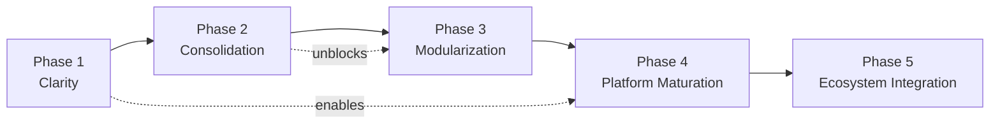

# Phased Roadmap — Sanctuary Platform

> **Status:** Initial audit — June 2026
> **Parent document:** [Architecture Audit](audit.md)
>
> **Purpose:** This roadmap describes how Sanctuary should evolve toward becoming the engineering platform for the Ego Hygiene organization. Each phase is composed of small, well-scoped issues rather than large reorganizations.
>
> **Important:** This document is prescriptive at the phase level but intentionally vague at the implementation level. Individual issues should be created and scoped separately for each action item.

---

## Guiding Principles

1. **Incremental over disruptive.** Each phase leaves the repository in a better state than it found it. No phase introduces regression.
2. **Clarity before extraction.** Responsibilities must be clearly defined and documented before any directory is extracted into a standalone repository.
3. **Consolidation before expansion.** Reduce duplication and process historical material before adding new capabilities.
4. **Composable over monolithic.** Prefer modular, composable primitives (Dev Container Features, versioned Make modules, standalone skill libraries) over integrated monoliths.
5. **Documented as a platform.** Every architectural decision should be documented so that future repositories can consume Sanctuary with confidence.

---

## Phase 1 — Clarity (Near-Term)

**Goal:** Make the current state of Sanctuary legible. Establish boundaries, remove ambiguity, and create the documentation baseline.

**Scope:** Analysis, documentation, and minimal structural decisions that do not move files.

### Actions

| Action | Description | Priority |
|---|---|---|
| Publish architecture audit | Merge this audit and all supporting documents into `main` | Immediate |
| Define skills source of truth | Document which of `skills/`, `.agents/skills/`, `.github/skills/` is authoritative | High |
| Enable MkDocs nav | Uncomment and populate `nav:` in `mkdocs.yml` to surface new architecture docs | High |
| Document layer boundaries | Explicitly document which layers depend on which others; prevent layering violations | High |
| Audit action version pinning | Review and pin GitHub Actions to immutable commit SHAs | Medium |
| Document garden vs docs boundary | Clarify what belongs in `docs/` vs `garden/` | Medium |
| Verify Poetry alignment | Run `poetry check`; confirm `pyproject.toml` is compatible with current Poetry version | Medium |

**Acceptance criteria for Phase 1:**

- [ ] Architecture audit is merged and visible in GitHub Pages.
- [ ] A single authoritative location for skills is documented.
- [ ] MkDocs nav is populated and architecture documents are navigable.
- [ ] Layer dependency rules are documented.

---

## Phase 2 — Consolidation (Short-Term)

**Goal:** Eliminate unnecessary duplication, process historical material, and remove ambiguity from the `.staging/` directory.

**Scope:** File movements within the repository, classification and resolution of staged material. No extractions yet.

### Actions

| Action | Description | Priority |
|---|---|---|
| Process `.staging/realignment/actions/` | Review staged GitHub Actions workflows; merge unique logic into `.github/workflows/` or discard | High |
| Process `.staging/realignment/scripts/` | Audit each legacy shell script; migrate unique scripts to `shell/bin/`; discard superseded | High |
| Process `.staging/realignment/linux/` | Audit legacy Linux config; merge unique items into `workstation/linux/`; discard covered | High |
| Process `.staging/realignment/devcontainer/` | Review Dev Container features and variants; evaluate for merge into `.devcontainer/` | High |
| Archive `.staging/realignment/egohygiene/` | Move TypeScript monorepo source to a product repository | Medium |
| Archive `.staging/realignment/website/` | Move website source to a web product repository | Medium |
| Archive `.staging/realignment/flutter-foundation/` | Move Flutter code to a product repository | Medium |
| Archive `.staging/realignment/homelab-private/` | Move homelab config to a private infrastructure repository | Medium |
| Process `.staging/realignment/obsidian/` | Evaluate staged PARA kit; merge into `garden/templates/` or discard | Low |
| Process `.staging/realignment/misc/` | Per-item evaluation; migrate, archive, or discard | Low |
| Process `.staging/realignment/tasks/` | Evaluate task files; merge into root `Taskfile.yml` or discard | Low |
| Process `.staging/realignment/papers/` | Archive to separate private repository | Low |
| Process `.staging/realignment/latex/` | Evaluate for merge with `templates/paper/` | Low |
| Process `.staging/realignment/universal/` | Evaluate for merge with `workstation/shared/` | Low |

**Acceptance criteria for Phase 2:**

- [ ] `.staging/` contains only material that is explicitly awaiting a future decision, with documented rationale.
- [ ] All "archive" items are moved out of the main repository.
- [ ] No functional Linux, shell, or Dev Container configuration exists only in `.staging/`.

---

## Phase 3 — Modularization (Medium-Term)

**Goal:** Extract the most self-contained, well-defined components from Sanctuary into standalone repositories under the Ego Hygiene organization.

**Scope:** Repository extractions for `shell/` and `skills/`. Each extraction is a separate, deliberate project.

### Actions

| Action | Description | Priority |
|---|---|---|
| Consolidate skills locations | Before extraction: ensure `skills/` is the canonical source; build step propagates to `.github/skills/` and `.agents/skills/` | High (prerequisite) |
| Extract `skills/` | Create `egohygiene/copilot-skills` (or equivalent); update references in Sanctuary | High |
| Establish shell versioning | Tag `shell/` with semantic versions; document public API surface | High (prerequisite) |
| Extract `shell/` | Create `egohygiene/shell` (or equivalent); update `.devcontainer/` and `workstation/` references | High |
| Define extraction pattern | Document the organizational pattern for future extractions (submodule vs package vs curl-install) | Medium |

**Acceptance criteria for Phase 3:**

- [ ] `egohygiene/copilot-skills` is a standalone, versioned repository.
- [ ] `egohygiene/shell` (or equivalent) is a standalone, versioned repository.
- [ ] Sanctuary consumes the extracted libraries via a defined mechanism.
- [ ] The extraction pattern is documented for future use.

---

## Phase 4 — Platform Maturation (Medium-Term)

**Goal:** Build out Sanctuary as a platform that other repositories actively consume. Expand capability coverage.

**Scope:** New capabilities, composable infrastructure, expanded template library.

### Actions

| Action | Description | Priority |
|---|---|---|
| Adopt Dev Container Features | Convert Dockerfile capabilities into composable Dev Container Features; publish to OCI | High |
| Expand template library | Add templates for: Python library, Go service, GitHub Action, documentation-only repository | High |
| Extract `automation/make/` | Create `egohygiene/makelib` (or equivalent) after shell extraction proves distribution model | Medium |
| Extract `templates/` | Create `egohygiene/templates` or integrate into a scaffold tool | Medium |
| Automate gitignore sync | Add Dependabot or sync workflow for `assets/gitignore/` against upstream | Low |
| Evaluate pnpm workspace | Determine if root-level pnpm workspace is justified; simplify if not | Low |
| Quartz v4 migration | Migrate `garden/quartz/` from v3 to v4 if applicable | Low |

**Acceptance criteria for Phase 4:**

- [ ] At least one standalone Dev Container Feature is published and referenced in `.devcontainer/`.
- [ ] Template library covers at least three distinct project types.
- [ ] `automation/make/` has a defined distribution strategy.

---

## Phase 5 — Ecosystem Integration (Long-Term)

**Goal:** Position Sanctuary as the engineering platform that all Ego Hygiene repositories consume. New repositories should bootstrap from Sanctuary rather than independently configure tooling.

**Scope:** Cross-repository integration, ecosystem governance, platform adoption.

### Actions

| Action | Description | Priority |
|---|---|---|
| Publish platform documentation | Publish comprehensive "how to consume Sanctuary" guide for new repositories | High |
| Create scaffold tooling | Build a CLI or script that creates a new Ego Hygiene repository from Sanctuary templates | High |
| Establish cross-repo conventions | Define and publish the organization-wide conventions that all repositories must follow | High |
| Repository template repository | Create a GitHub repository template that new repos can use to inherit Sanctuary defaults | Medium |
| Platform changelog | Maintain a changelog for Sanctuary's platform-facing APIs (shell, skills, make library, templates) | Medium |
| Reuse compliance for consumers | Extend REUSE compliance guidance to cover how consumers should attribute Sanctuary-sourced code | Low |

**Acceptance criteria for Phase 5:**

- [ ] At least one new Ego Hygiene repository is bootstrapped from Sanctuary templates.
- [ ] A "consuming Sanctuary" guide is published in `docs/`.
- [ ] Platform changelog exists and is maintained.

---

## Dependency Diagram Between Phases

---

## Success Metrics

| Phase | Metric |
|---|---|
| Phase 1 | Architecture audit visible in GitHub Pages; skills source of truth documented |
| Phase 2 | `.staging/` emptied or each item has explicit classification and next-action |
| Phase 3 | `skills/` and `shell/` exist as standalone repositories; Sanctuary consumes them |
| Phase 4 | At least one Dev Container Feature published; template library expanded |
| Phase 5 | New repositories bootstrap from Sanctuary; "consuming Sanctuary" guide published |

---

## Evidence

- `docs/architecture/audit.md` — Audit findings driving this roadmap
- `docs/architecture/extraction-candidates.md` — Extraction prioritization
- `docs/architecture/duplication-report.md` — Duplication motivating Phase 2
- `docs/architecture/modernization-report.md` — Modernization motivating Phases 3–4
- `skills/` — Extraction candidate
- `shell/` — Extraction candidate
- `.staging/realignment/` — Consolidation material for Phase 2
- `.devcontainer/` — Platform maturation target
- `templates/` — Expansion target
